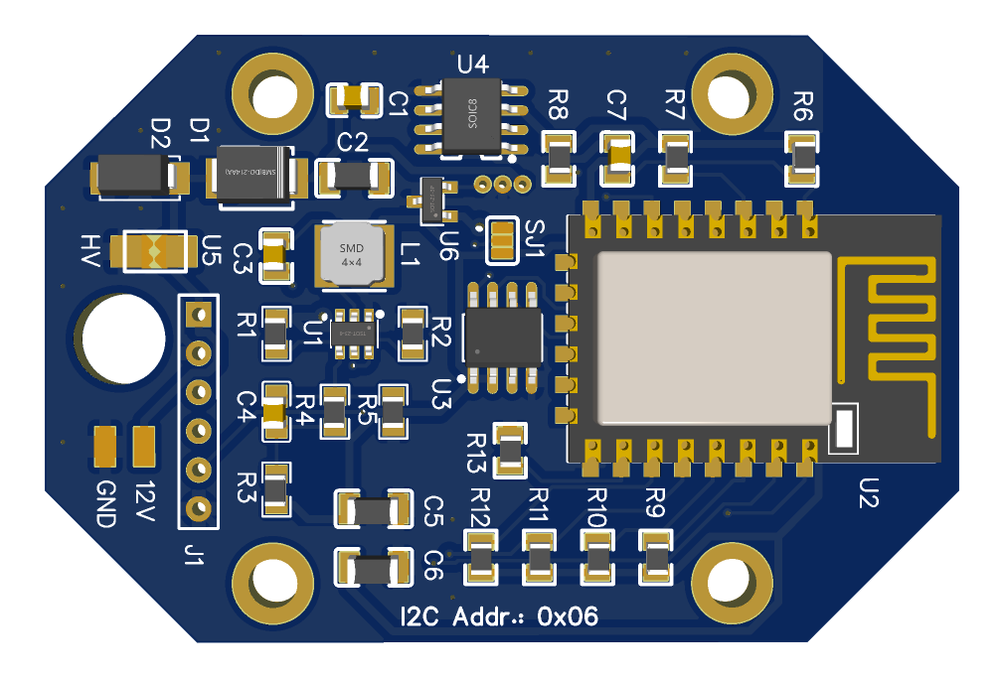
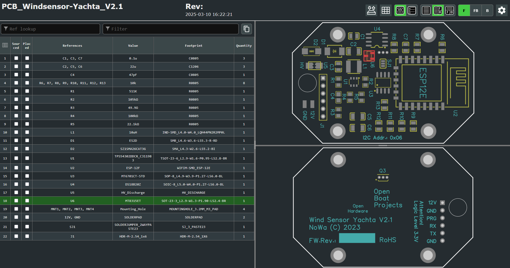

Documents
=========

Gerber files for Yachta PCB
---------------------------

	* `Gerber files [ZIP] <../_static/files/Gerber_Windsensor-Yachta-Final-2.1_PCB_Windsensor-Yachta_2025-07-21.zip>`_
	
BOM and pick and place list
---------------------------

	* `BOM list [CSV] <../_static/files/BOM_Windsensor-Yachta-Final-2.1_2025-07-21.csv>`
	* `Pick and place list [CSV] <../_static/files/PickAndPlace_PCB_Windsensor-Yachta_2025-07-21.csv>`

PCB production details
----------------------

	* `Production details [PNG] <../_static/files/PCB_Product_Details.png>`_

Schematic
---------

	* `Yachta V2.1 [PDF] <../_static/files/Schematic_Windsensor-Yachta-Final-2.1_2025-07-21.pdf>`_
	
Yachta PCB
----------

.. image:: ../pics/PCB_Yachta_V2.1_Top.png
			   :scale: 70%		   
		Fig.: PCB top side V2.1
		
.. image:: ../pics/PCB_Yachta_V2.1_Bot.png
			   :scale: 70%		   
		Fig.: PCB bottom side V2.1
		

		Fig.: PCB top side 3D V2.1

Online tool parts placing
-------------------------

	* `Online parts placing tool [HTML] <../_static/files/https://open-boat-projects.org/wp-content/uploads/2025/03/ibom_yachta_v2.1.html>`_

		Fig.: Online parts placing tool