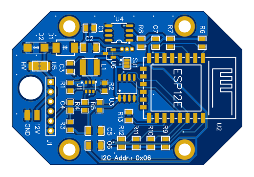
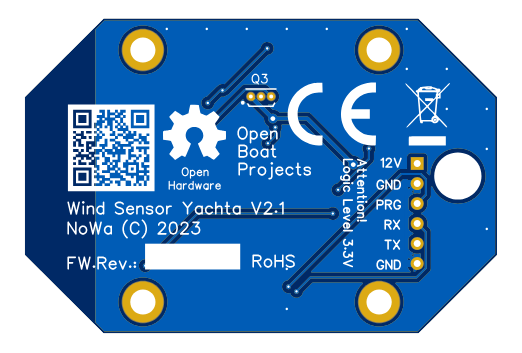

Documents
=========

Gerber files for Yachta PCB
---------------------------

	* `Gerber files [ZIP] <../_static/files/Gerber_Windsensor-Yachta-Final-2.1_PCB_Windsensor-Yachta_2025-07-21.zip>`_
	
BOM and pick and place list
---------------------------

	* `BOM list [CSV] <../_static/files/BOM_Windsensor-Yachta-Final-2.1_2025-07-21.csv>`_
	* `Pick and place list [CSV] <../_static/files/PickAndPlace_PCB_Windsensor-Yachta_2025-07-21.csv>`_

Production details
------------------

	* `PCB production details [PNG] <../_static/files/PCB_Product_Details.png>`_
	* `Short instruction list [TXT] <../_static/files/Instruction_List.txt>`_

Schematic
---------

	* `Yachta V2.1 [PDF] <../_static/files/Schematic_Windsensor-Yachta-Final-2.1_2025-07-21.pdf>`_
	
Yachta PCB
----------

Fig.: PCB top side V2.1
		

Fig.: PCB bottom side V2.1
		
.. image:: /pics/Yachta_BCP_V2.1.png
	:scale: 30%   
Fig.: PCB top side 3D V2.1

Online tool parts placing
-------------------------

.. raw:: html

       	
	
Fig.: Online parts placing tool