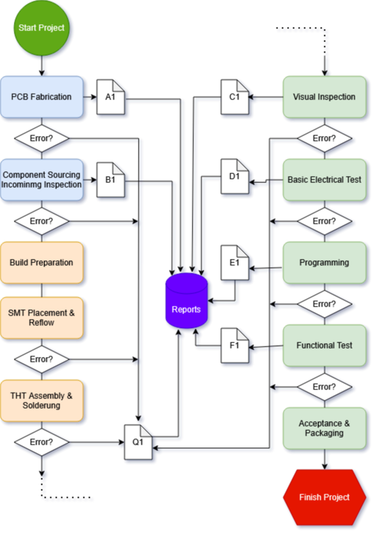

Process Overview
================

Edit Link: `Process Diagram`_

.. _Process Diagram: https://cryptpad.disroot.org/diagram/#/2/diagram/edit/cgOYoZsNX4Ax2wKQQ-6QN+1V/p/

**1)** PCB fabrication (external or in‑house)

**2)** Component Sourcing & Incoming Inspection

**3)** Build preparation (stencil, solder paste, line setup)

**4)** SMT placement & reflow

**5)** THT assembly & soldering (selective/wave/hand)

**6)** Visual inspection (AOI/manual)

**7)** Basic Electrical Test

**8)** Programming (Flashing)

**9)** Functional Test (FCT)

**10)** Acceptance & Packaging (FCT)

